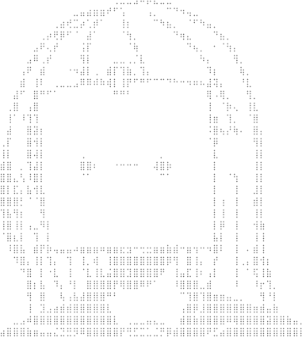

## 👋🏻 Hello, I'm Dmitry!

**About me:**

🌱 I’m currently learning DevOps and system design. 
💬 Ask me about anything, I am happy to help.  
📫 How to reach me: [t.me/intejie](https://t.me/intejie) 

**I know a bit about:**

 

 

 

